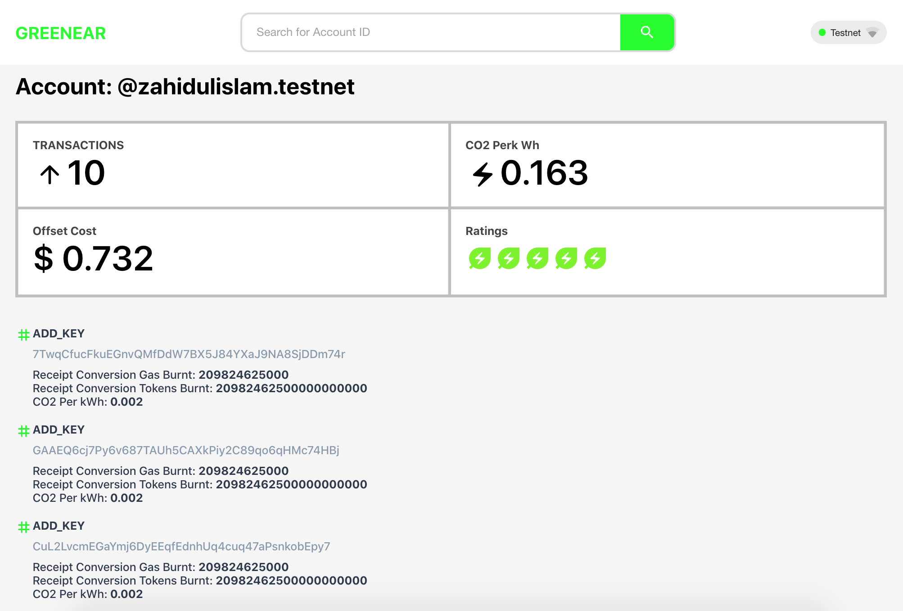

# NEAR CO2 APP

Web App for tracking NEAR account-level carbon emission.

# Getting started

`~> git clone git@github.com:Zahidul-Islam/near-co2-app.git ~> cd near-co2-app`

# Run

`~> npm install ~> npm start`

# Explore

[Demo](http://localhost:3000)
